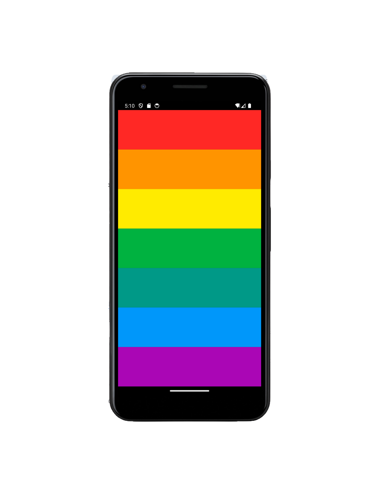

# Xylophone Mobile App

## Overview
The Xylophone Mobile App is an engaging and interactive musical instrument app developed using Flutter and Dart. This app transforms your mobile device into a colorful xylophone, allowing users to play musical notes by tapping on the bars. It is designed for users of all ages to enjoy and learn basic music concepts through a fun and intuitive interface.

## Features
Simple and Intuitive Interface: The app features a user-friendly design that makes it easy for anyone to start playing immediately.
High-Quality Sound: Each bar on the xylophone produces a distinct, high-quality sound corresponding to musical notes.
Colorful Bars: The xylophone bars are color-coded for easy identification and a visually appealing experience.
Responsive Touch Controls: Smooth and responsive touch controls ensure an enjoyable playing experience.
Educational: Helps users, especially children, to learn and recognize different musical notes and sounds.

Screenshot


## Installation
Clone the repository:
```
git clone https://github.com/sepideh68/xylophone_flutter.git
```
Navigate to the project directory:
```
cd xylophone_app
```
Install dependencies:
```
flutter pub get
```
Run the app:
```
flutter run
```
## Technologies Used
Flutter: A UI toolkit for building natively compiled applications for mobile from a single codebase.
Dart: A client-optimized language for fast apps on any platform.

## Acknowledgements
Flutter and Dart for providing a powerful framework and language for app development.

Open source community for providing valuable resources and libraries.

This is a companion project to The App Brewery's Complete Flutter Development Bootcamp, check out the full course at www.appbrewery.co
